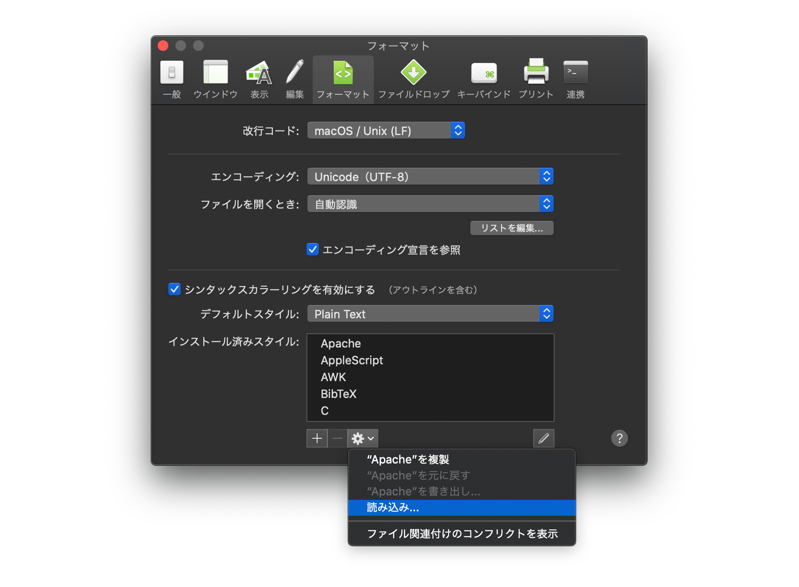

FileMaker syntax coloring for CotEditor
================

macOS 用のシンプルで強力なテキストエディタ [CotEditor](https://coteditor.com/) で 複雑な FileMaker 計算式を見やすくする為のシンタックスカラーリングファイル

## Spec

* FileMaker 19 までの関数、キーワードに対応
* カスタム関数を含めた関数のカラーリングに対応
* 通常の変数（`$`, `$$`）に加えて、関数内変数用のキーワードとしてチルダ（`~`）も変数としてカラーリング
* 文字列内の特殊文字列（`\\`, `\"`, `¶`）のハイライト


## Install

### Download

[latest release FileMaker.yaml](https://github.com/hazi/filemaker-syntax-coteditor/releases/latest/download/FileMaker.yaml)

### Import



CotEditorの環境設定 > フォーマット > インストール済みスタイル: > 読み込み… > ダウンロードした `FileMaker.yaml` を選択

## Contributing

* リポジトリをフォークし、そのリポジトリのブランチを元に Pull request を作成してください。
* コミット前に `./normalizer` を必ず実行してください。

### normalizer

コミット前に Terminal で normalizer を実行してください。

CotEditor から書き出したファイルそのままでは、出力順がその度に変わり差分が分かりづらいため、normalizer で順番をソートします。

```
$ ./normalizer
```

実行前のファイルが`FileMaker.yaml.back`として保存され、ノーマライズされたファイルが`FileMaker.yaml`として保存されます。

`FileMaker.yaml.back` はコミットしないようにしてください。

## License

Licensed under the [BSD license](./LICENSE).

Fork from [frudens/filemaker-syntax-coteditor](https://github.com/frudens/filemaker-syntax-coteditor)
