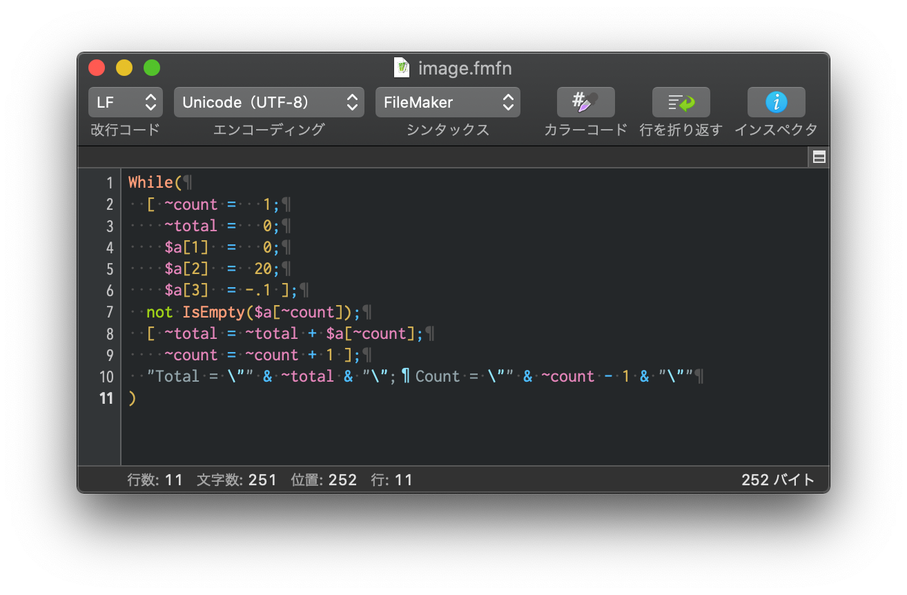

filemaker-syntax-coteditor
================

FileMaker CotEditor Syntax Highlighting



## Install

### Download

[Download FileMaker.yaml](https://raw.githubusercontent.com/hazi/filemaker-syntax-coteditor/master/FileMaker.yaml)

### Import

CotEditor > 環境設定 > フォーマット > インストール済みスタイル > 読み込み… > `FileMaker.yaml`を選択

## Spec

* 通常の変数（\$, $$）に加えて、関数内変数用のキーワードとしてチルダ（~）も変数としてハイライトします
* FileMaker 18 までの関数、キーワードに対応しています

## Contributing

* リポジトリをフォークし、そのリポジトリのブランチを元に Pull request を作成してください。
* コミット前に normalizer を必ず実行してください。

### normalizer

コミット前に Terminal で normalizer を実行してください。

CotEditor から書き出したファイルそのままでは、出力順がその度に変わり差分が分かりづらいため、normalizer で順番をソートします。

```
$ ./normalizer
```

実行前のファイルが`FileMaker.yaml.back`として保存され、ノーマライズされたファイルが`FileMaker.yaml`として保存されます。

`FileMaker.yaml.back` はコミットしないようにしてください。

----

[Fork from frudens/filemaker-syntax-coteditor](https://github.com/frudens/filemaker-syntax-coteditor)